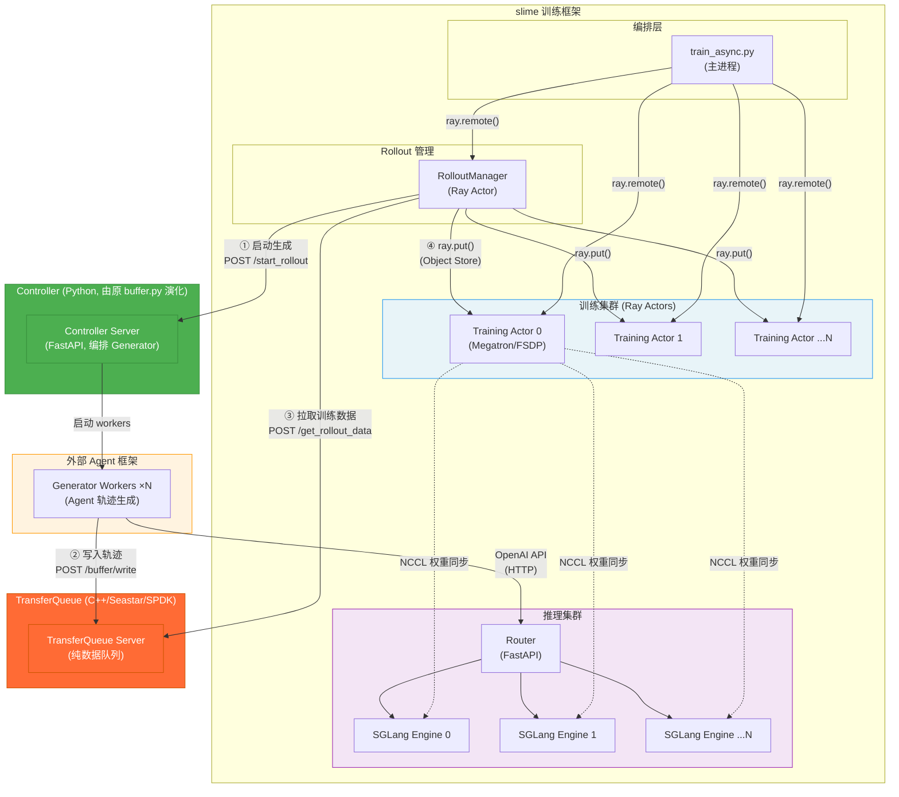
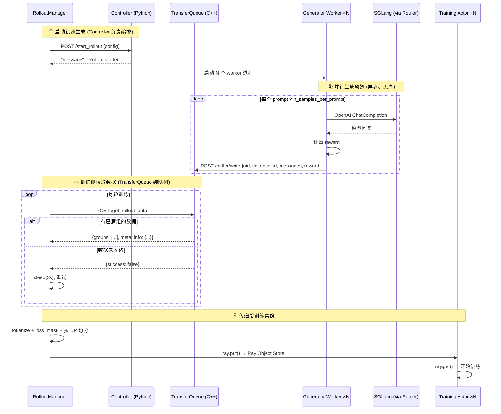
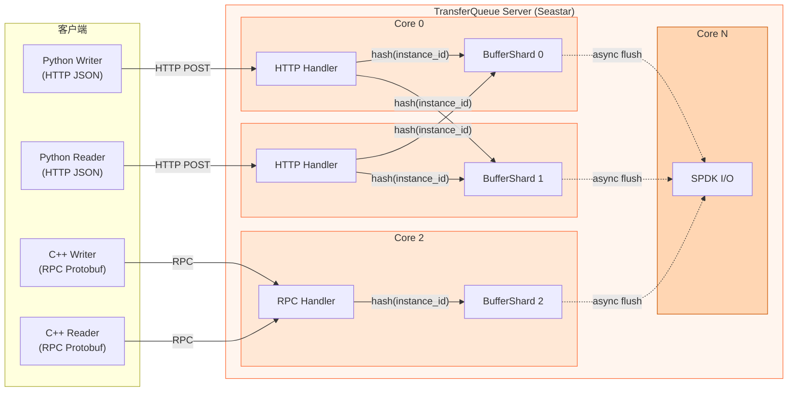

# TransferQueue 设计文档

> 高性能 Rollout-Training 数据交互队列

## 1. 概述

### 1.1 背景

[slime](https://github.com/THUDM/slime) 是为 RL scaling 设计的 LLM post-training 框架。在 Agentic RL 异步训练场景中，rollout（轨迹生成）与 training（模型训练）之间需要一个数据交互队列：

- **Rollout 侧**：多个 Generator worker 并行生成 agent 轨迹，异步、无序、耗时不等
- **Training 侧**：需要批量、有序的训练数据

当前的 Rollout Buffer（Python FastAPI，[buffer.py](file:///home/allen/workspaces/slime/slime_plugins/rollout_buffer/buffer.py)）同时承担了「数据存储队列」和「Generator 编排」两个职责，存在性能瓶颈：Python GIL 限制并发、JSON 序列化开销大、无持久化、无背压控制。

新的设计将原有 Rollout Buffer 拆分为两个独立组件：

- **Controller**（Python）：从原有 `buffer.py` 演化而来，负责 Generator worker 的生命周期管理和任务编排（`/start_rollout`），保留 Python 实现
- **TransferQueue**（C++ / Seastar / SPDK）：纯数据交互队列，仅负责轨迹数据的高性能写入、聚合和读取

### 1.2 设计目标

| 目标 | 说明 |
|------|------|
| **兼容性** | 保留 HTTP REST API，现有 Python 代码零改动对接 |
| **高性能** | Protobuf 序列化 + Seastar per-core 无锁架构 |
| **可持久化** | 通过 SPDK 落盘，支持故障恢复 |
| **可观测** | 实时状态查询、指标暴露 |

---

## 2. 架构

### 2.1 TransferQueue 在 slime 中的位置



### 2.2 数据流全景



### 2.3 TransferQueue 内部架构



**关键设计**：
- 按 `hash(instance_id) % num_cores` 分片 → 同一 instance 的数据总在同一 core → **无锁聚合**
- 每个 core 独立管理内存池，无 core 间竞争
- SPDK I/O 在专用 core 上异步执行，不阻塞写入路径

---

## 3. 数据模型

### 3.1 Protobuf 定义

```protobuf
syntax = "proto3";
package transferqueue;

// 单条对话消息
message ChatMessage {
    string role = 1;          // "system" | "user" | "assistant" | "tool"
    string content = 2;
}

// 单条轨迹（一次 LLM 完整交互）
message Trajectory {
    string uid = 1;                      // 全局唯一轨迹 ID (UUID)
    string instance_id = 2;              // 问题实例 ID（同一 prompt 共享）
    repeated ChatMessage messages = 3;   // 完整对话历史
    double reward = 4;                   // 奖励分数
    map<string, string> extra_info = 5;  // 附加元数据
}

// 轨迹组（按 instance_id 聚合）
message TrajectoryGroup {
    string instance_id = 1;
    repeated Trajectory trajectories = 2;
    int32 group_size = 3;                // 目标组大小 (= n_samples_per_prompt)
    bool is_complete = 4;
}

// 批量读取结果
message BatchReadResult {
    bool success = 1;
    string message = 2;
    repeated TrajectoryGroup groups = 3;
    MetaInfo meta_info = 4;
}

message MetaInfo {
    int64 total_samples = 1;
    int32 num_groups = 2;
    double avg_group_size = 3;
    double avg_reward = 4;
    repeated string finished_group_ids = 5;
}

// Buffer 状态
message BufferStatus {
    int64 total_trajectories = 1;
    int64 total_consumed = 2;
    int32 pending_groups = 3;          // 已满组未读取
    int32 incomplete_groups = 4;       // 未满组
    int64 memory_usage_bytes = 5;
    int64 disk_usage_bytes = 6;
}
```

### 3.2 instance_id 与 uid 的关系

```
一道题 (instance_id = "math_42")
├── 采样 1: uid="a1b2c3"  reward=1.0 ✅
├── 采样 2: uid="d4e5f6"  reward=0.0 ❌
├── 采样 3: uid="g7h8i9"  reward=1.0 ✅    ← 收齐 group_size 条后
└── 采样 4: uid="j0k1l2"  reward=0.0 ❌       组标记为 ready，可被读取
```

---

## 4. API 设计

> **职责划分**：TransferQueue 仅负责数据的写入和读取，不涉及 Generator 编排。`/start_rollout` 由 Controller 提供。

### 4.1 HTTP REST API（兼容层）

保持与现有 Python 客户端完全兼容。

#### `POST /buffer/write` — 写入单条轨迹

| 项目 | 说明 |
|------|------|
| **调用方** | Generator worker (Python) |
| **Content-Type** | `application/json` |
| **幂等性** | 基于 `uid` 去重 |

**请求体**：

```json
{
    "uid": "a3b8d1b6-...",
    "instance_id": "math_42",
    "messages": [
        {"role": "user", "content": "Solve: 2x + 3 = 7"},
        {"role": "assistant", "content": "x = 2\n\\boxed{2}"}
    ],
    "reward": 1.0,
    "extra_info": {
        "timestamp": "1707900000.0",
        "finish_reason": "stop",
        "label": "2"
    }
}
```

**响应体**：

```json
{
    "success": true,
    "message": "Data has been successfully written to buffer",
    "data": {"data": [<写入的item>], "meta_info": "write to buffer"}
}
```

---

#### `POST /get_rollout_data` — 读取已就绪的训练数据

| 项目 | 说明 |
|------|------|
| **调用方** | slime RolloutManager (Python) |
| **语义** | 消费式读取，读后删除 |
| **请求体** | `{}` |

**响应体**：

```json
{
    "success": true,
    "message": "Successfully read 64 items",
    "data": {
        "data": [
            {"uid": "...", "instance_id": "...", "messages": [...], "reward": 1.0, "extra_info": {...}},
            ...
        ],
        "meta_info": {
            "total_samples": 128,
            "num_groups": 8,
            "avg_group_size": 16,
            "avg_reward": 0.65,
            "finished_groups": ["math_42", "math_17", ...]
        }
    }
}
```

---

> **注意**：`/start_rollout` API 不在 TransferQueue 中，而是由 **Controller** 提供。Controller 继承了原 `buffer.py` 的编排职责，负责管理 Generator worker 的生命周期。详见 [4.4 Controller API](#44-controller-api-python由原-bufferpy-演化)。

---

### 4.2 高性能 RPC API（新增）

使用 Seastar RPC 框架，Protobuf 编码，供升级后的客户端使用。

#### `BatchWrite` — 批量写入轨迹

```
RPC BatchWrite(BatchWriteRequest) -> BatchWriteResponse
```

```protobuf
message BatchWriteRequest {
    repeated Trajectory trajectories = 1;
}
message BatchWriteResponse {
    bool success = 1;
    int32 written_count = 2;
}
```

| 项目 | 说明 |
|------|------|
| **场景** | 高吞吐写入，替代逐条 HTTP POST |
| **优势** | 批量减少网络往返；Protobuf 比 JSON 快 5-10x |

---

#### `BatchRead` — 批量读取已就绪的轨迹组

```
RPC BatchRead(BatchReadRequest) -> BatchReadResult
```

```protobuf
message BatchReadRequest {
    int32 max_groups = 1;     // 最多返回多少组
    bool block = 2;           // 是否阻塞等待
    int32 timeout_ms = 3;     // 阻塞超时 (ms)
}
```

| 项目 | 说明 |
|------|------|
| **场景** | 训练侧高效拉取数据 |
| **`block=true`** | 数据不足时阻塞等待，消除训练侧轮询 |

---

#### `GetStatus` — 查询 Buffer 状态

```
RPC GetStatus(Empty) -> BufferStatus
```

| 项目 | 说明 |
|------|------|
| **场景** | 监控、调试 |
| **返回** | 总轨迹数、已消费数、待处理组数、内存/磁盘使用量 |

---

#### `Subscribe` — 流式推送

```
RPC Subscribe(SubscribeRequest) -> stream TrajectoryGroup
```

```protobuf
message SubscribeRequest {
    int32 prefetch_groups = 1;    // 预取组数
}
```

| 项目 | 说明 |
|------|------|
| **场景** | 训练侧实时接收数据，消除轮询延迟 |
| **模式** | 服务端流：数据就绪即推送 |

---

### 4.3 管理 API（TransferQueue）

#### `POST /config` — 动态配置

```json
{
    "group_size": 16,
    "task_type": "math",
    "max_memory_bytes": 8589934592,
    "spill_to_disk_threshold": 0.8,
    "uid_dedup": true,
    "group_timeout_seconds": 300
}
```

#### `DELETE /buffer/instance/{instance_id}` — 删除指定 instance 数据

#### `POST /buffer/reset` — 清空 Buffer

---

### 4.4 Controller API（Python，由原 buffer.py 演化）

Controller 保留 Python FastAPI 实现，职责是 **Generator 编排**，不处理数据存储。

#### `POST /start_rollout` — 启动轨迹生成

| 项目 | 说明 |
|------|------|
| **调用方** | slime RolloutManager (Python) |
| **说明** | 配置并启动 Generator workers，workers 会将数据写入 TransferQueue |
| **所在服务** | **Controller**（非 TransferQueue） |

**请求体**：

```json
{
    "num_process": "100",
    "num_epoch": "3",
    "remote_engine_url": "http://...:30000",
    "remote_buffer_url": "http://...:8889",
    "task_type": "math",
    "input_file": "/path/to/prompts.jsonl",
    "num_repeat_per_sample": "16",
    "max_tokens": "4096",
    "sampling_params": {"max_tokens": 4096, "temperature": 1.0, "top_p": 1.0},
    "tokenizer_path": "/path/to/model",
    "skip_instance_ids": ["id1", "id2"]
}
```

**响应体**：`{"message": "Rollout started"}`

> `remote_buffer_url` 指向 TransferQueue 的地址，Controller 将此地址传给 Generator workers，使其直接写入 TransferQueue。

---

## 5. 核心机制

### 5.1 Group 聚合

TransferQueue 的核心语义是 **group-based 聚合**：

1. 每条写入的轨迹按 `instance_id` 归入对应组
2. 当组内轨迹数达到 `group_size` 时，标记为 **ready**
3. 只有 ready 的组才会被 `get_rollout_data` / `BatchRead` 返回
4. 读取后从 Buffer 中删除（消费语义）

```
写入顺序（异步、无序）:
  write(instance_id=A, uid=1)   → group_A: [1]          (1/4, 未满)
  write(instance_id=B, uid=2)   → group_B: [2]          (1/4, 未满)
  write(instance_id=A, uid=3)   → group_A: [1,3]        (2/4, 未满)
  write(instance_id=A, uid=4)   → group_A: [1,3,4]      (3/4, 未满)
  write(instance_id=A, uid=5)   → group_A: [1,3,4,5]    (4/4, ✅ ready!)
  read()                        → 返回 group_A，从 buffer 删除
```

### 5.2 内存管理与 SPDK 溢出

```
内存使用率
  0%                    80%                   100%
  |─────── 内存 ─────────|──── SPDK 磁盘 ──────|
                         ↑ spill_to_disk_threshold
```

- 内存使用率 < 80%：数据仅在内存中
- 内存使用率 ≥ 80%：新写入的未满组数据溢出到 SPDK 磁盘
- 读取时：优先从内存读取，内存缺失则从 SPDK 加载

### 5.3 uid 去重

每个 BufferShard 维护一个 bloom filter + LRU 精确集合：
- 写入时先查 bloom filter（O(1)），通过再查精确集合
- 重复 uid 直接丢弃，返回成功（幂等）

---

## 6. 与 slime 的集成

### 6.1 部署方式

```bash
# 1. 启动 TransferQueue（纯数据队列）
./transferqueue --port 8889 --cores 4 --group-size 16

# 2. 启动 Controller（Generator 编排，由原 buffer.py 演化）
python controller.py --port 8890 --buffer-url http://...:8889

# 3. slime 训练脚本
#    --rollout-buffer-url 指向 TransferQueue（数据读取）
#    --controller-url 指向 Controller（启动生成）
bash rollout_buffer_example.sh
```

### 6.2 升级路径

| 阶段 | 改动 | 效果 |
|------|------|------|
| **Phase 1** | 仅替换服务端（C++ TransferQueue），客户端仍用 HTTP JSON | 零改动部署，服务端性能提升 |
| **Phase 2** | Generator 侧改用 `BatchWrite` RPC（Python gRPC 客户端） | 写入吞吐提升 5-10x |
| **Phase 3** | 训练侧改用 `Subscribe` 流式读取 | 消除轮询延迟 |

### 6.3 无需修改的现有代码

| 文件 | 说明 |
|------|------|
| `base_generator.py` → `send_data_to_buffer()` | HTTP `/buffer/write` 完全兼容 |
| `rollout_buffer_example.py` → `get_rollout_data()` | HTTP `/get_rollout_data` 完全兼容 |
| `rollout_buffer_example.sh` → `--rollout-buffer-url` | 端口和路径不变 |

---

## 7. API 一览表

### TransferQueue（C++ / Seastar / SPDK，纯数据队列）

| API | 协议 | 调用方 | 方向 | 说明 |
|-----|------|--------|------|------|
| `POST /buffer/write` | HTTP JSON | Generator worker | 写入 | 单条轨迹写入 |
| `POST /get_rollout_data` | HTTP JSON | RolloutManager | 读取 | 批量读取已满组数据 |
| `BatchWrite` | RPC Protobuf | 高性能 Writer | 写入 | 批量轨迹写入 |
| `BatchRead` | RPC Protobuf | 高性能 Reader | 读取 | 批量读取 + 阻塞模式 |
| `GetStatus` | RPC Protobuf | 监控系统 | 查询 | Buffer 状态 |
| `Subscribe` | RPC Stream | Training | 读取 | 流式推送就绪数据 |
| `POST /config` | HTTP JSON | 管理员 | 配置 | 动态参数调整 |
| `DELETE /buffer/instance/{id}` | HTTP | 管理员 | 管理 | 删除指定 instance |
| `POST /buffer/reset` | HTTP | 管理员 | 管理 | 清空 Buffer |

### Controller（Python / FastAPI，Generator 编排）

| API | 协议 | 调用方 | 方向 | 说明 |
|-----|------|--------|------|------|
| `POST /start_rollout` | HTTP JSON | RolloutManager | 控制 | 启动 Generator workers |
